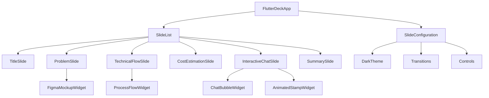

# 設計書

## 概要

XTalk20260218プロジェクトにおいて、flutter_deckパッケージを使用したエンジニアリング向けライトニングトーク用プレゼンテーションを実装する。テーマは「不要な機能実装のコスト」について、6枚のスライドで構成され、各スライドにアニメーション効果を適用する。

## アーキテクチャ

### 全体構成



### レイヤー構造

1. **プレゼンテーション層**: FlutterDeckAppとスライド定義
2. **ウィジェット層**: 再利用可能なカスタムウィジェット
3. **アニメーション層**: 各種アニメーション効果の実装
4. **テーマ層**: ダークテーマとカラーパレット定義

## コンポーネントとインターフェース

### 主要コンポーネント

#### 1. FlutterDeckApp（メインアプリケーション）
```dart
class PresentationApp extends StatelessWidget {
  @override
  Widget build(BuildContext context) {
    return FlutterDeckApp(
      configuration: FlutterDeckConfiguration(...),
      slides: [...],
      lightTheme: FlutterDeckThemeData.light(),
      darkTheme: FlutterDeckThemeData.dark(),
      themeMode: ThemeMode.dark,
    );
  }
}
```

#### 2. スライドベースクラス
```dart
abstract class BaseSlide extends FlutterDeckSlideWidget {
  const BaseSlide({
    required FlutterDeckSlideConfiguration configuration,
    super.key,
  }) : super(configuration: configuration);
}
```

#### 3. カスタムウィジェット
- `FigmaMockupWidget`: Figmaデザインモックアップ表示
- `ProcessFlowWidget`: 技術フロー図表示
- `InteractiveChatSlide`: インタラクティブチャット機能
- `AnimatedStampWidget`: アニメーション付きスタンプ
- `CostCardWidget`: コスト見積もりカード

### インターフェース定義

#### アニメーション制御インターフェース
```dart
abstract class AnimatedSlideWidget {
  void startAnimation();
  void resetAnimation();
  Duration get animationDuration;
}
```

#### チャット状態管理インターフェース
```dart
enum ChatState {
  initial,
  messageSent,
  typing,
  replied,
  completed
}

class ChatMessage {
  final String text;
  final bool isFromSelf;
  final DateTime timestamp;
}
```

## データモデル

### スライド設定モデル
```dart
class SlideConfig {
  final String route;
  final String title;
  final Duration transitionDuration;
  final bool hasAnimation;
  final List<AnimationStep> animationSteps;
}

class AnimationStep {
  final Duration delay;
  final Duration duration;
  final Curve curve;
  final AnimationType type;
}

enum AnimationType {
  fadeIn,
  slideIn,
  scaleIn,
  staggered
}
```

### テーマ設定モデル
```dart
class PresentationTheme {
  static const Color backgroundColor = Color(0xFF121212);
  static const Color primaryColor = Color(0xFF1976D2); // Deep Blue
  static const Color warningColor = Color(0xFFFF5722); // Red/Orange
  static const Color successColor = Color(0xFF4CAF50); // Green
  static const Color textColor = Color(0xFFFFFFFF); // White
  static const Color secondaryTextColor = Color(0xFFBDBDBD); // Light Grey
}
```

### チャットデータモデル
```dart
class ChatData {
  final List<ChatMessage> messages;
  final ChatState currentState;
  final bool isTyping;
  
  ChatData copyWith({
    List<ChatMessage>? messages,
    ChatState? currentState,
    bool? isTyping,
  });
}
```

## 正確性プロパティ

*プロパティとは、システムのすべての有効な実行において真であるべき特性や動作のことです。これは人間が読める仕様と機械で検証可能な正確性保証の橋渡しとなる正式な記述です。*

事前作業分析に基づき、以下のプロパティを特定しました。多くの受入基準は特定の表示内容やレイアウトの確認であるため、exampleテストとして実装されます。プロパティテストは、より一般的な規則や動作パターンに焦点を当てます。

### プロパティ1: テーマとカラーパレットの一貫性
*すべての*スライドについて、表示時にダークテーマ（背景色: #121212）が適用され、指定されたカラーパレット（ディープブルー、赤/オレンジ、緑、白/ライトグレー）が使用される
**検証対象: 要件1.1, 1.3**

### プロパティ2: ウィジェットベース実装の徹底
*すべての*視覚要素について、外部画像ファイル（.png/.jpg）を使用せず、Flutterウィジェットとして実装される
**検証対象: 要件1.4**

### プロパティ3: Material Designアイコンの適切な使用
*すべての*アイコン表示について、Material Designアイコンライブラリから適切なアイコンが選択され使用される
**検証対象: 要件8.4**

### プロパティ4: StatefulWidget実装の適切性
*すべての*状態管理が必要なウィジェットについて、StatefulWidgetとして適切に実装され、状態変更が正しく反映される
**検証対象: 要件8.5**

### プロパティ5: アニメーション継続時間の制約
*すべての*アニメーション実行について、継続時間が200-500msの範囲内に設定される
**検証対象: 要件9.4**

### プロパティ6: 要素表示アニメーションの適用
*すべての*スライド内要素について、表示時にフェードイン、スライドイン、またはスケールアニメーションのいずれかが適用される
**検証対象: 要件9.1**

### プロパティ7: スライド遷移アニメーションの適用
*すべての*スライド間遷移について、スムーズなページ遷移アニメーションが適用される
**検証対象: 要件9.2**

### プロパティ8: インタラクティブフィードバックアニメーション
*すべての*インタラクティブ要素について、操作時に適切なフィードバックアニメーションが表示される
**検証対象: 要件9.3**

### プロパティ9: 段階的アニメーションの実装
*すべての*複数要素の順次表示について、段階的なアニメーション（staggered animation）が適用される
**検証対象: 要件9.5**

## エラーハンドリング

### アニメーション関連エラー
- **AnimationController破棄エラー**: dispose()メソッドでの適切なリソース解放
- **アニメーション競合エラー**: 複数アニメーション同時実行時の状態管理
- **タイミングエラー**: Future.delayedの例外処理

### 状態管理エラー
- **不正な状態遷移**: ChatStateの無効な遷移を防ぐバリデーション
- **メモリリーク**: StatefulWidgetの適切なdispose実装
- **非同期処理エラー**: async/awaitの例外ハンドリング

### レンダリングエラー
- **オーバーフローエラー**: レスポンシブデザインでの画面サイズ対応
- **ウィジェット構築エラー**: null安全性の確保
- **テーマ適用エラー**: ダークテーマ設定の検証

## テスト戦略

### 二重テストアプローチ

**ユニットテスト**:
- 各カスタムウィジェットの個別機能テスト
- アニメーション制御ロジックのテスト
- 状態遷移の特定パターンテスト
- エラー条件とエッジケースのテスト

**プロパティベーステスト**:
- 最小100回の反復実行
- ランダム入力による包括的カバレッジ
- 各プロパティに対応する個別テスト
- タグ形式: **Feature: flutter-presentation, Property {番号}: {プロパティテキスト}**

### テスト設定

**プロパティベーステストライブラリ**: `test`パッケージと`faker`パッケージを組み合わせて使用

**テスト構成**:
- ウィジェットテスト: 各スライドの表示確認
- インテグレーションテスト: スライド間遷移の確認
- アニメーションテスト: アニメーション完了の確認
- 状態管理テスト: チャット機能の状態遷移確認

**テストカバレッジ目標**:
- コードカバレッジ: 90%以上
- ウィジェットカバレッジ: 100%（全スライド）
- アニメーションカバレッジ: 100%（全アニメーション効果）
